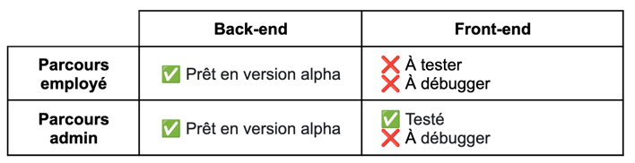

# Billed front-end

Projet n°9 OpenClassrooms - [Parcours Développeur d'application JavaScript 
React](https://openclassrooms.com/fr/paths/877-developpeur-dapplication-javascript-react)

## Objectifs



## Résultats et couverture des tests

- CI automatisée à chaque PR sur main avec [GitHub Actions](https://github.com/sedomu/oc_p9_Billed-app-FR-Front/actions/workflows/node.js.yml) (tous 
  tests ok ✅)
- Rapport Jest: publiés automatiquement à chaque PR sur main avec [GitHub 
  Pages](https://sedomu.github.io/oc_p9_Billed-app-FR-Front/) (couverture > 
  80% ✅)
- Assurance du code version Alpha avec le plan de tests E2E (exécution manuelle)

## Fonctionnement du projet

### L'architecture du projet :
Ce projet, dit frontend, est connecté à un service API backend que vous devez aussi lancer en local.

Le projet backend se trouve ici: https://github.com/OpenClassrooms-Student-Center/Billed-app-FR-back

### Organiser son espace de travail :
Pour une bonne organization, vous pouvez créer un dossier bill-app dans lequel vous allez cloner le projet backend et par la suite, le projet frontend:

Clonez le projet backend dans le dossier bill-app :
```
$ git clone https://github.com/OpenClassrooms-Student-Center/Billed-app-FR-Back.git
```

```
bill-app/
   - Billed-app-FR-Back
```

Clonez le projet frontend dans le dossier bill-app :
```
$ git clone https://github.com/OpenClassrooms-Student-Center/Billed-app-FR-Front.git
```

```
bill-app/
   - Billed-app-FR-Back
   - Billed-app-FR-Front
```

### Comment lancer l'application en local ?

#### étape 1 - Lancer le backend :

Suivez les indications dans le README du projet backend.

#### étape 2 - Lancer le frontend :

Allez au repo cloné :
```
$ cd Billed-app-FR-Front
```

Installez les packages npm (décrits dans `package.json`) :
```
$ npm install
```

Installez live-server pour lancer un serveur local :
```
$ npm install -g live-server
```

Lancez l'application :
```
$ live-server
```

Puis allez à l'adresse : `http://127.0.0.1:8080/`


## Comment lancer tous les tests en local avec Jest ?

```
$ npm run test
```

### Comment lancer un seul test ?

Installez jest-cli :

```
$npm i -g jest-cli
$jest src/__tests__/your_test_file.js
```

### Comment voir la couverture de test ?

`http://127.0.0.1:8080/coverage/lcov-report/`

### Comptes et utilisateurs :

Vous pouvez vous connecter en utilisant les comptes:

#### administrateur : 
```
utilisateur : admin@test.tld 
mot de passe : admin
```
#### employé :
```
utilisateur : employee@test.tld
mot de passe : employee
```
